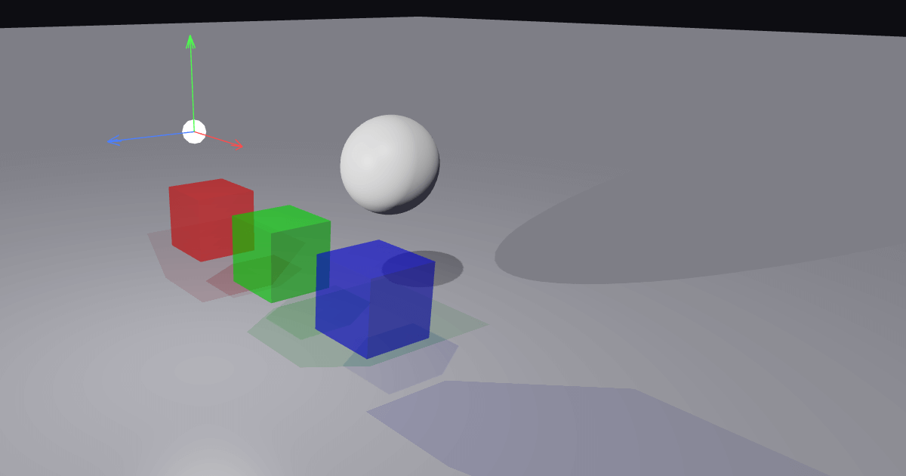

# WebGL2 Lighting Playground

A browser-based 3D scene editor for experimenting with real-time lighting, shadows, and translucent color mixing - built entirely with vanilla JavaScript and WebGL2.

**[Interactive Demo](https://xedur.github.io/webgl2-lighting-playground/)**



## What Is This?

WebGL2 Lighting Playground is an interactive tool that lets you place objects and lights in a 3D scene and see how they interact in real time. Its standout feature is an **additive colored light model**: light passing through translucent objects becomes tinted, and tinted lights mix additively - just like real colored light. A red cube and a green cube next to each other will cast overlapping yellow light on the ground behind them.

## Features

### Scene Editing
- Add and remove **cubes**, **spheres**, and **planes**
- Add **directional**, **point**, and **spot** lights
- Transform objects with **move**, **rotate**, and **scale** gizmos
- Edit material properties: color, opacity, specular, roughness, and thickness
- Full **undo/redo** history (up to 20 steps)
- Duplicate any object or light with one click
- Toggle visibility per entity in the scene hierarchy

### Lighting & Shadows
- **Directional lights** with orthographic shadow maps
- **Point lights** with cubemap shadow atlases
- **Spotlights** with perspective shadow projection and inner/outer angle control
- **Transmission rendering** - translucent objects tint light passing through them instead of blocking it
- **Soft shadows** toggle for smoother shadow edges
- Per-light shadow bias control to prevent shadow acne

### Rendering
- **Quality presets**: Low (512), Medium (1024), High (2048), Ultra (4096) shadow resolution
- Real-time **FPS** and **draw call** counters
- Back-to-front sorted translucency
- Depth-only pre-pass for correct transmission accumulation

### Camera
- **Orbit** (left-drag), **pan** (right-drag), **zoom** (scroll)
- Touch support: single-finger orbit, pinch to zoom
- Smooth damping for fluid camera motion

## Keyboard Shortcuts

| Key | Action |
|-----|--------|
| Q | Select tool |
| W | Move tool |
| E | Rotate tool |
| R | Scale tool |
| Delete | Delete selected entity |
| Ctrl+D | Duplicate selected entity |
| Ctrl+Z | Undo |
| Ctrl+Y | Redo |

## Getting Started

No build step required. Serve the project folder with any static HTTP server:

```bash
# Python
python -m http.server 8000

# Node.js (npx)
npx serve .

# Or use XAMPP, Nginx, Apache, etc.
```

Then open `http://localhost:8000` in a browser that supports WebGL2.

## Project Structure

```
├── index.html          Main page
├── manifest.json       PWA manifest
├── css/
│   └── style.css       UI styling
└── js/
    ├── main.js         Entry point
    ├── scene.js        Scene graph, entities, transforms
    ├── renderer.js     WebGL2 rendering pipeline
    ├── shaders.js      GLSL shader sources
    ├── camera.js       Orbit camera and controls
    ├── ui.js           UI panels, property editor, toolbar
    ├── tools.js        Transform gizmos (move/rotate/scale)
    ├── geometry.js     Geometry generators (cube, sphere, plane)
    ├── math.js         Vector and matrix math utilities
    └── gl-utils.js     WebGL helper functions
```

## Browser Requirements

A modern browser with **WebGL2** support (Chrome, Firefox, Edge, Safari 15+).

## Author

[© 2025-2026 Eetu Rantanen](https://www.erantanen.com)

## License

MIT
